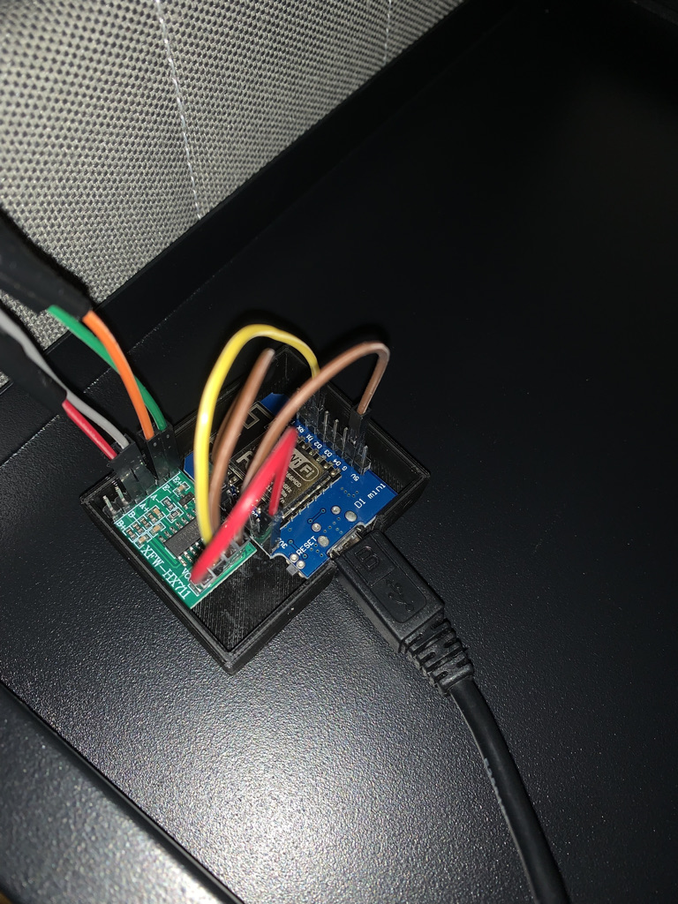

# bed-occupancy-sensor-esphome
Made using [ESPHome](https://github.com/esphome/esphome)
To install use the update the secrets.yaml ssid/password and use bed_occupancy_sensor.yaml as a source for ESPHome flashing.

#### Bed foot socket made for Ikea bed legs, see included .f3d file 

#### esp8266 and hx711 in custom 3d printed cover

